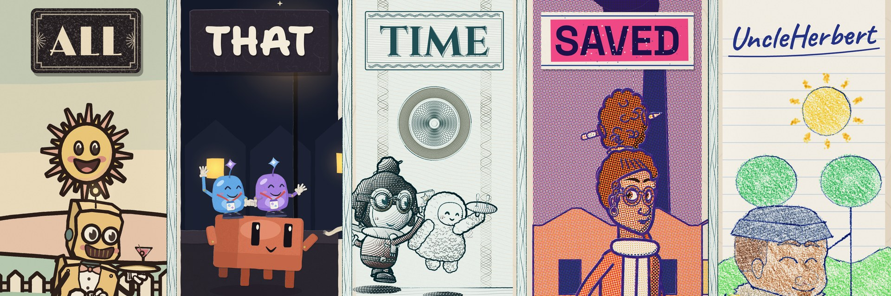

# All That Time Saved

A music video for UncleHerbert's song "All That Time Saved": six minutes of animation drawn entirely in code (p5.js and
p5.brush, rendered headless), through five media: 1930s rubber hose, cut card, risograph, banknote engraving and
notebook doodle. Animation, design and code by Claude (Opus 5.5) in Claude Code, directed shot by shot by UncleHerbert,
orchestrated in [T3 Code](https://github.com/pingdotgg/t3code). Built on
[Claude Animation Base](https://github.com/JohnHeibel/ClaudeAnimationBase) by John Heibel.

**Licence.** The code is MIT ([LICENSE](LICENSE)); what that doesn't cover is in [NOTICE](NOTICE). The song, lyrics, film and artwork are not: (c) 2026 UncleHerbert,
all rights reserved. The fonts are under the SIL Open Font License. Claude, Copilot, Gemini, Grok, Muse and Codex, and
their mascots, are trademarks of their owners; this is an independent work of parody and commentary, not affiliated
with, sponsored or endorsed by any of them.

Setup on this machine (no npm; Chromium; AMD GPU):

```bash
bun install
python3 -m venv .venv && .venv/bin/pip install -r requirements.txt
# the song: tempo map, lyric timings, voices
.venv/bin/python tools/beatmap.py assets/song.mp3    # → assets/beatmap.json + src/beatmap.js (tempo map, bars, sections)
.venv/bin/python -m demucs --two-stems=vocals -n htdemucs -o out/audio/stems assets/song.mp3   # isolated vocals
.venv/bin/python tools/transcribe.py assets/song.mp3 --out out/audio/words.json               # rough word times (ASR)
.venv/bin/python tools/lyrics.py brief/lyrics.md out/audio/words.json                        # structure + rough times
.venv/bin/python tools/align.py out/audio/stems/htdemucs/song/vocals.wav                     # exact word times (forced alignment)
.venv/bin/python tools/voices.py out/audio/stems/htdemucs/song/vocals.wav                    # who sings; ears win: assets/voice_overrides.json
```

## Render it

You need bun (or Node.js), Chromium and ffmpeg. The film is `video/studio.html`, the song's 54 storyboard shots; the
render commands are in [video/README.md](video/README.md), and how a shot is built is in
[video/ch/README.md](video/ch/README.md). The renderer's options are at the top of [render.mjs](render.mjs); the
pages' `?query` switches are listed in [docs/SWITCHES.md](docs/SWITCHES.md).

If Chrome isn't in a standard location, pass `--chrome=<path>` or set `CHROME_PATH`. On Linux, `render.mjs` starts Chrome with `--no-sandbox` (Ubuntu 23.10+ blocks Chrome's sandbox in headless use) and also finds a Chromium installed by Playwright. With no GPU at all, add `--soft-gl` to render WebGL in software. On a headless Linux machine with an NVIDIA GPU (a cloud or cluster node), add `--gpu-angle=gl-egl` (or `vulkan`); `node gpu_probe.mjs <chrome path>` shows which renderer each set of flags gets.

## What's here

| path | what it is |
|---|---|
| [video/](video/) | The film: `studio.html` (the whole song), `board.js` (the storyboard), `ch/` (the chapters), `dev-<chapter>.html` (one chapter each) |
| [demo/](demo/) | The drawing layer (`style.js`: the five looks), the cast, the sets, props, and `dev-*.html` model-sheet pages. See [demo/README.md](demo/README.md) |
| [src/](src/) | The kit's engine (`core.js`; `clawd.js`: emotions and idle life; `timeline.js`: shots and loops), the song's tempo map and lyrics (`beatmap.js`, `tempo.js`, `lyrics.js`) and the subtitles (`karaoke.js`) |
| [brief/](brief/) | The user's direction: story, style, decisions, reference images |
| [docs/](docs/) | [STORYBOARD.md](docs/STORYBOARD.md) (generated from `video/board.js` by `node tools/board_md.mjs`); the kit's Clawd model sheets ([emotions](docs/emotions.jpg), [views, motion and hats](docs/views.jpg)) |
| [assets/](assets/) | The song, its tempo map and lyric timings, the subtitle font |
| [tools/](tools/) | The song's analysis (Python, see above), `steps.py` (finds stretches that move on twos) and `board_md.mjs` (the storyboard's Markdown export) |
| [render.mjs](render.mjs) | Headless renderer: contact sheets, frame strips, crops, stills, MP4 |
| [ANIMATION_GUIDE.md](ANIMATION_GUIDE.md) | The kit's guide: timing, acting and the engine's API (its medium rules don't apply here) |
